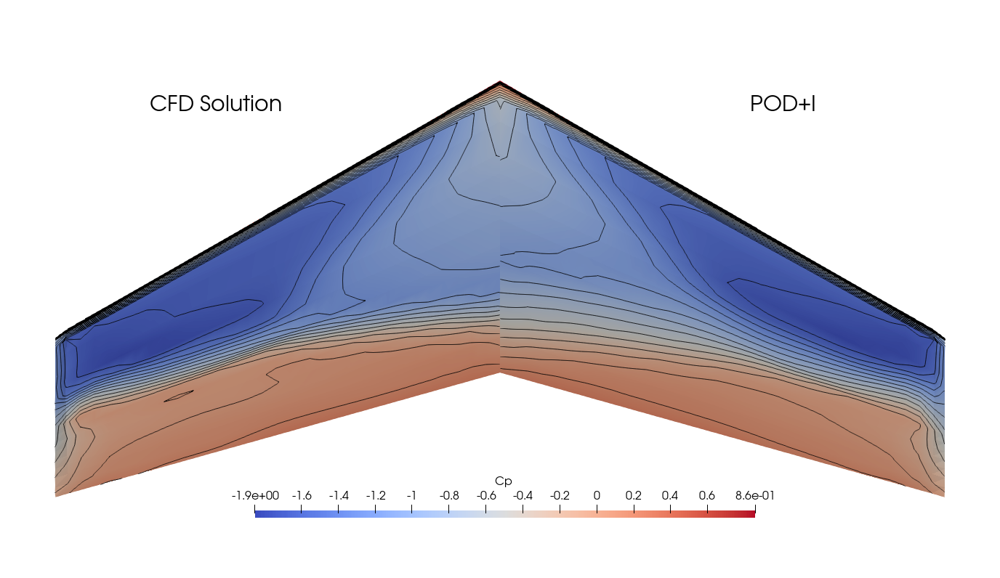
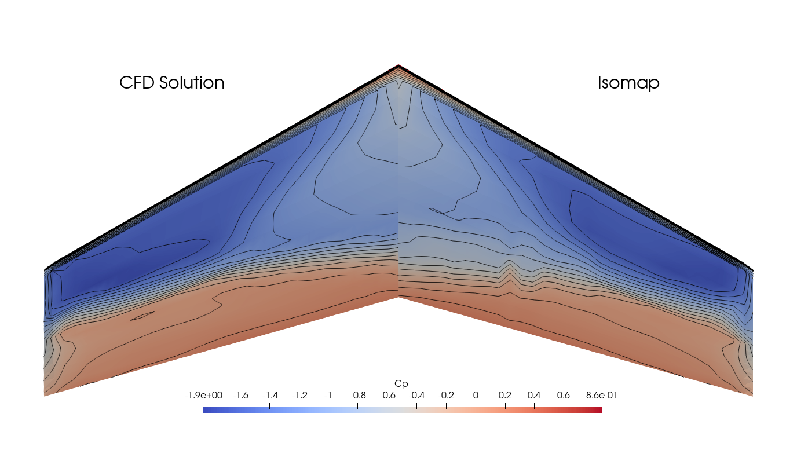
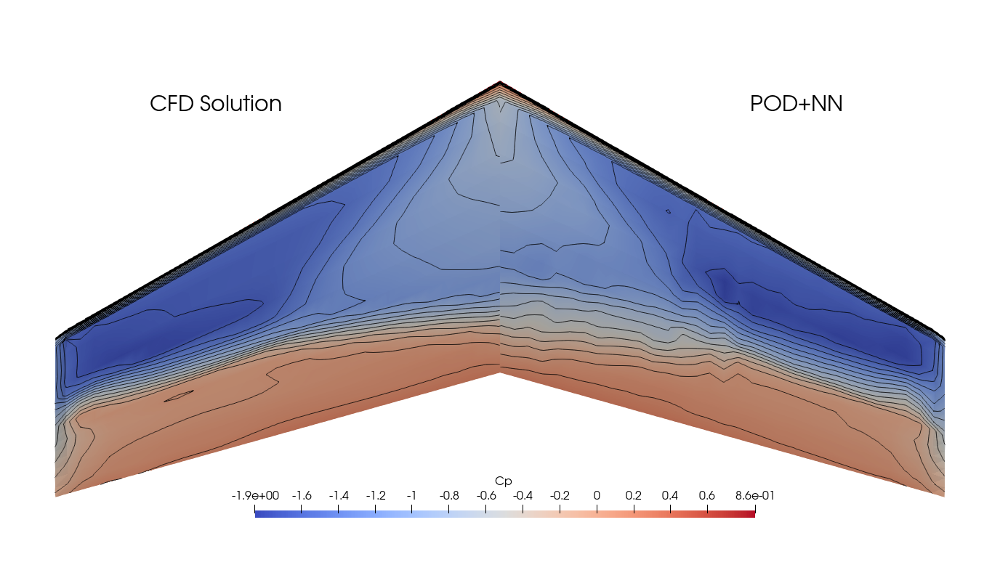
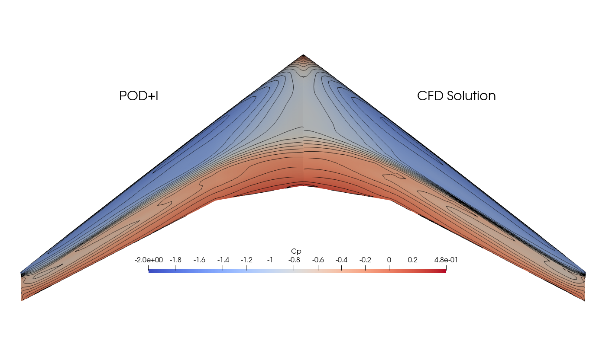
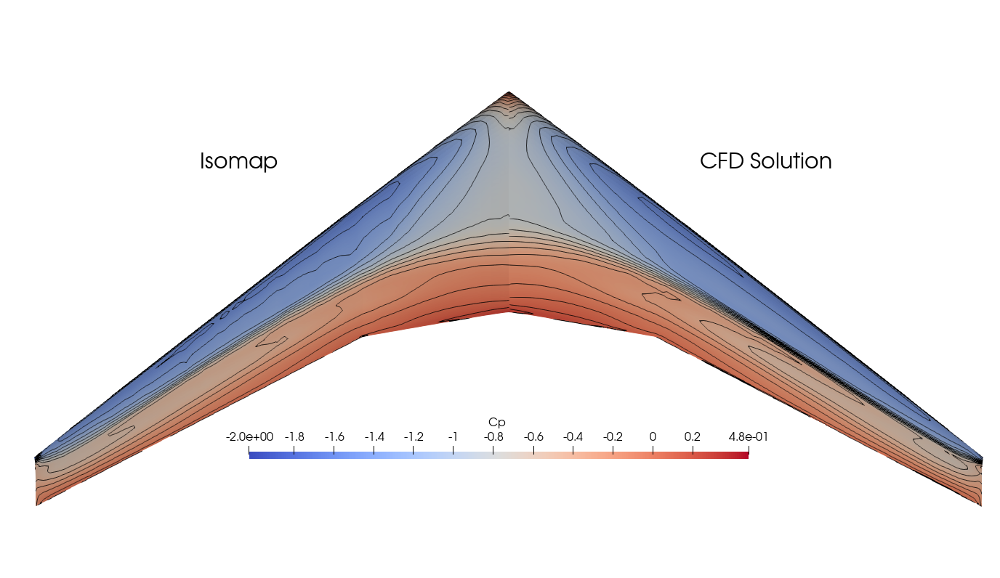
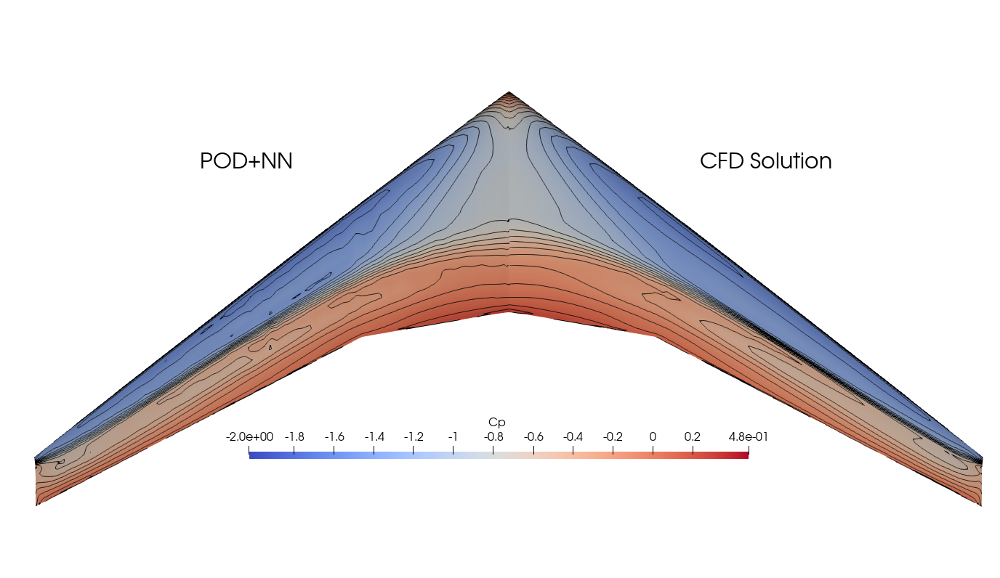

# Interpolation-reduced-order-models
Interpolation-based reduced-order models

High-fidelity computational fluid dynamics (CFD) solutions are time consuming, therefore sufficiently accurate approximate solutioins are sought. The methods in this repository are non-intrusive, and function based on training data from full-order solvers. The methods project the data into a lower-dimensional subspace and interpolate.

Methods in this repository:
- Proper Orthogonal Decomposition coupled with radial basis function interpolation (POD+I)
- Isomap coupled with radial basis function interpolation (Isomap+I)
- Proper Orthogonal Decomposition  coupled with regression neural network (POD+NN)

Proper Orthogonal Decomposition (POD) is a method closely related to Principal Component Analysis (PCA), used for dimension reduction in machine learning.

Isomap is a nonlinear dimensionality reduction method used to compute the low-dimensional embedding of high dimensional data. It is based on geodesic distances between data points.

Numpy, SciPy, Scikit-learn are used throughout. The neural network is implemented using PyTorch. 

The following results, visualized using Paraview, demonstrate the capabilities of the models in predicting the pressure coefficient profiles over the Onera M6 and CRM wings:

Onera M6 POD+I versus CFD Solution at Mach = 0.826, AoA = 7.73 deg

Onera M6 Isomap+I versus CFD Solution at Mach = 0.826, AoA = 7.73 deg

Onera M6 POD+NN versus CFD Solution at Mach = 0.826, AoA = 7.73 deg

CRM POD+I versus CFD Solution at Mach = 0.815, AoA = 4.13 deg

CRM Isomap+I versus CFD Solution at Mach = 0.815, AoA = 4.13 deg

CRM POD+NN versus CFD Solution at Mach = 0.815, AoA = 4.13 deg

